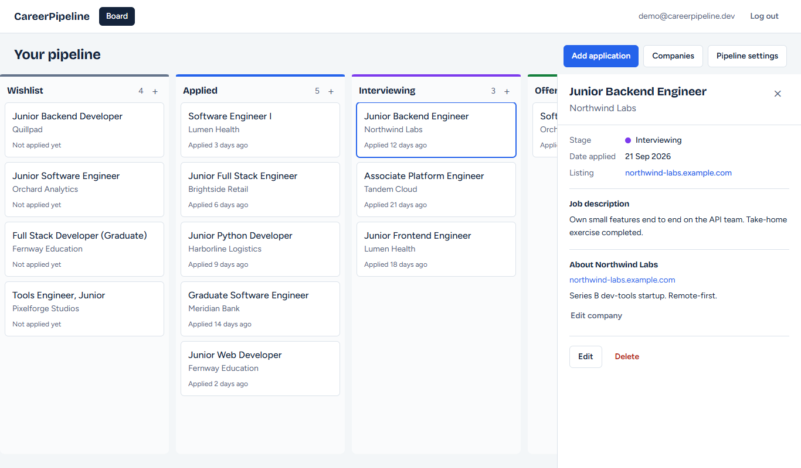
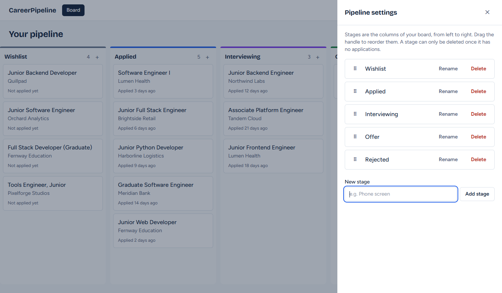
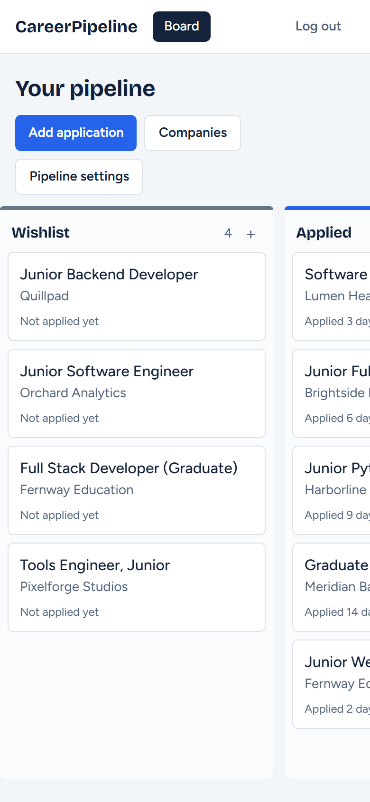
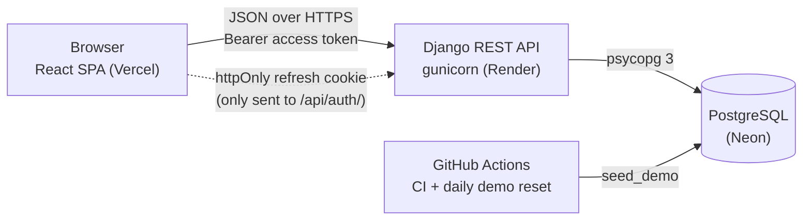
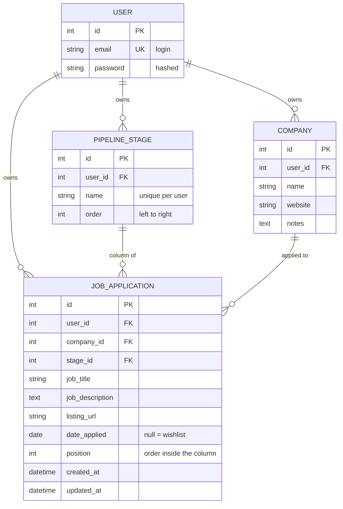

# CareerPipeline

[](https://github.com/Ervzs/CareerPipeline/actions/workflows/ci.yml)

A job application tracker with a CRM-style Kanban board. Each column is a stage of your search
(Wishlist, Applied, Interviewing, Offer, Rejected, or your own), and each card is an application.
Drag cards between stages, keep notes on every company, and see where your search stands.

**Live demo:** _add the Vercel URL here after deploying (steps in [DEPLOY.md](DEPLOY.md))_
&nbsp;·&nbsp; **Demo login:** press **Try the demo** on the login page, no typing needed.
Locally the demo account is `demo@careerpipeline.dev` / `DemoPipeline2026!` after `seed_demo`.

> The free-tier backend sleeps when idle, so the first request after a quiet period can take up to a
> minute. See [Cold starts](#free-tier-cold-starts).


|  |  |
|---|---|
|  |  |
| Details pane beside the board, with the company's notes | Add, rename, delete and reorder stages |

On a phone the board scrolls sideways and the details cover the screen:



## What it does

- **Kanban board** with drag and drop between and within columns (mouse, touch, or keyboard).
  Moves apply instantly and roll back with an explanation if the server refuses them.
- **Your own pipeline:** add, rename, reorder and delete stages. A stage that still holds
  applications can't be deleted, and the app explains why.
- **Applications and companies:** create an application for an existing company or a new one in the
  same step; edit and delete both. A company with applications can't be deleted.
- **Details pane:** description, listing link, date applied and the company's notes.
- **Accounts:** register, log in, or try the demo. Every user only ever sees their own data.

## Architecture



The access token (5 minutes) lives only in JavaScript memory. The refresh token (7 days, rotated on
every use) is an `HttpOnly` cookie that scripts can't read, so on every page load the app silently
trades the cookie for a fresh access token.

## Data model



Every row carries `user_id`, the multi-tenancy key. `stage` and `company` use `ON DELETE PROTECT`,
which is what blocks deleting something that is still in use.

## Tech stack

| Layer | Tools |
|---|---|
| Backend | Python, Django 5.2 LTS, Django REST Framework, SimpleJWT, drf-spectacular (OpenAPI), django-cors-headers, WhiteNoise, gunicorn |
| Database | PostgreSQL through psycopg 3 |
| Frontend | React 19, TypeScript, Vite, Tailwind CSS 4, TanStack Query, React Router, dnd-kit |
| Quality | pytest + pytest-django, ruff, Vitest + Testing Library, oxlint, Prettier, GitHub Actions |
| Hosting (free tiers) | Vercel (frontend), Render (API), Neon (database) |

## Quality

- **Backend:** 110 pytest tests covering authentication (hashing, cookie flags, rotation, logout and
  blacklisting), default stages, **tenant isolation for every model** (user A can't read, change,
  delete or reference user B's data), card re-sequencing, stage reorder validation, blocked deletes,
  the seed command, and the production settings. `ruff check` and `ruff format --check` are clean.
- **Frontend:** 58 Vitest tests covering the API client (token refresh, single-flight retry), auth
  flow, route protection, the board, optimistic move with rollback, and every dialog.
- **CI** runs all of it on every push: backend on Python 3.13 and 3.14 against a real PostgreSQL,
  frontend on Node 24.
- The drag gesture and the responsive layout were also exercised in a real browser (Edge) against a
  running backend.

## Repository layout

```
backend/    Django REST API (accounts = auth, pipeline = stages/companies/applications)
frontend/   React + TypeScript single-page app
docs/       Screenshots used in this README
render.yaml Render Blueprint      DEPLOY.md  Manual deployment steps
PLAN.md     Plan, decisions and progress
```

## Backend — local setup (Windows / PowerShell)

Requirements: Python 3.12+ and PostgreSQL 14+ (no Docker needed).

### 1. Create the PostgreSQL role and database

Run once, as the `postgres` superuser (you will be prompted for its password). Pick your own
password for the app role:

```powershell
psql -U postgres -c "CREATE ROLE career_user LOGIN PASSWORD 'choose-a-password' CREATEDB;"
psql -U postgres -c "CREATE DATABASE careerpipeline OWNER career_user;"
```

`CREATEDB` lets pytest create and drop its own `test_careerpipeline` database.
If the role already exists, use `ALTER ROLE career_user PASSWORD '...' CREATEDB;` instead.

### 2. Install and configure

```powershell
cd backend
python -m venv .venv
.\.venv\Scripts\Activate.ps1
pip install -r requirements-dev.txt
Copy-Item .env.example .env      # then edit .env: SECRET_KEY and DB_PASSWORD at least
```

All configuration comes from environment variables (see `backend/.env.example`). `.env` is
git-ignored and must never be committed.

### 3. Migrate, seed, run

```powershell
python manage.py migrate
python manage.py seed_demo       # demo account + sample board; safe to re-run (it resets it)
python manage.py runserver
```

- API: <http://localhost:8000/api/>
- Interactive docs (Swagger UI): <http://localhost:8000/api/docs/> — raw schema at `/api/schema/`
- Django admin: create an admin with `python manage.py createsuperuser`

### 4. Tests and lint

```powershell
pytest                 # needs the CREATEDB privilege from step 1
ruff check .
ruff format --check .
```

## Frontend — local setup

Requirements: Node 20+ (developed on Node 24) and the backend running on port 8000.

```powershell
cd frontend
npm install
Copy-Item .env.example .env      # VITE_API_URL and the demo credentials
npm run dev                      # http://localhost:5173
```

| Command | Purpose |
|---|---|
| `npm run dev` | Dev server with hot reload |
| `npm test` | Unit and component tests (Vitest + Testing Library) |
| `npm run lint` | oxlint |
| `npm run build` | Type-check and production build into `dist/` |
| `npm run format` | Prettier |

Keyboard dragging: Space picks a card up, the arrow keys move it, Space drops it, Escape cancels.
Enter opens the card's details. On touch screens, press and hold a card briefly to drag it.

## API overview

| Method | Path | Purpose |
|---|---|---|
| POST | `/api/auth/register/` | Create an account (email + password, validated by Django's password validators) |
| POST | `/api/auth/login/` | Returns `{access}`; sets the refresh token as an httpOnly cookie |
| POST | `/api/auth/refresh/` | Reads the cookie, rotates it, returns a new `{access}` |
| POST | `/api/auth/logout/` | Blacklists the refresh token and clears the cookie |
| GET | `/api/auth/me/` | Current user |
| CRUD | `/api/stages/` | Pipeline stages (new stages are appended at the end) |
| POST | `/api/stages/reorder/` | `{"stage_ids": [...]}` — the complete list of your stage ids in the new order |
| CRUD | `/api/companies/` | Companies |
| CRUD | `/api/applications/` | Applications; the list comes back in board order (column, then position) |
| PATCH | `/api/applications/{id}/move/` | `{"stage": id, "position": n}` — moves a card and re-sequences both columns |
| GET | `/api/health/` | Liveness probe (no authentication, no database access) |

Every request except register/login/refresh/logout/health needs `Authorization: Bearer <access>`.

**Errors** always look like `{"error": {"code": "...", "message": "...", "details": {...}}}`.
Validation problems use `validation_error` (field messages in `details`); blocked deletes
return **409** with `stage_not_empty` or `company_in_use`.

**Creating an application** takes exactly one of `company` (id of an existing company) or
`company_name` (finds your company with that name, or creates it). Responses include both
`company` (id) and a nested `company_detail`.

## Design decisions

- **Custom user model from the first migration** — email is the login field; there is no username.
- **Tenant isolation by construction** — every viewset filters by `request.user`, `user` is set
  server-side and never read from the client, and every foreign-key field only accepts objects the
  caller owns (`OwnedPrimaryKeyRelatedField`). Another user's ids return 404 or a validation error.
  `tests/test_isolation.py` checks this for every model.
- **Deleting is blocked, not cascaded** — a stage or company that still has applications cannot be
  deleted (`on_delete=PROTECT` → 409), so a click can never silently destroy applications.
- **Positions are managed by the server** — cards change column or order only through the move
  endpoint, which runs in a transaction with row locks and keeps positions contiguous (0..n-1).
  The frontend predicts the result with a pure function (`moveApplication`) that mirrors those rules,
  which is what makes the optimistic update safe to roll back.
- **No pagination** — one person's board is small and the Kanban needs all of it at once.
- **Refresh token in an httpOnly cookie** — JavaScript only ever holds the 5-minute access token.
- **One error shape** — the API and the UI agree on `{error: {code, message, details}}`, so forms can
  show field errors and the UI can react to specific codes.

### Cookie, CORS and token settings

| Setting (env var) | Local development | Production (Vercel → Render, cross-site) |
|---|---|---|
| `REFRESH_COOKIE_SAMESITE` | `Lax` | `None` |
| `REFRESH_COOKIE_SECURE` | `False` | `True` (required with `SameSite=None`) |
| `CORS_ALLOWED_ORIGINS` | `http://localhost:5173` | the exact Vercel origin(s) |
| `CORS_ALLOW_CREDENTIALS` | always `True` | always `True` |

The cookie is `HttpOnly`, scoped to `Path=/api/auth/`, and the refresh token rotates on every use
(the previous one is blacklisted). Access tokens last 5 minutes, refresh tokens 7 days.

CSRF note: the cookie is only sent to the `/api/auth/` endpoints. A cross-site page can trigger a
refresh request, but CORS stops it from reading the response, so it never obtains the access token;
all other endpoints authenticate with the `Authorization` header, which browsers don't attach
automatically.

**Known limits** (also in [DEPLOY.md](DEPLOY.md)): browsers that block third-party cookies (Safari,
Brave) won't keep the cross-site refresh cookie, so those users have to log in again after a reload
unless the app and API share a domain or the API is proxied through Vercel. And because refresh
tokens rotate, closing the tab at the exact moment a refresh is in flight can force a new login.

## Free-tier cold starts

The API runs on Render's free plan, which **sleeps after about 15 minutes without traffic**; the next
request waits roughly 30–60 seconds while it wakes up. The app shows a loading state meanwhile.
The Neon database also suspends when idle but resumes in under a second.

## Deployment

Everything needed is in the repo; the steps that need your accounts are in
[DEPLOY.md](DEPLOY.md). CI runs on every push (`.github/workflows/ci.yml`) and a scheduled workflow
resets the demo account daily (`.github/workflows/demo-reset.yml`).
