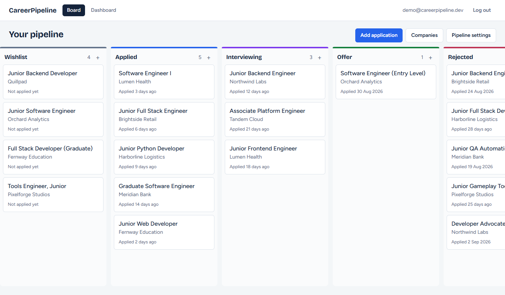
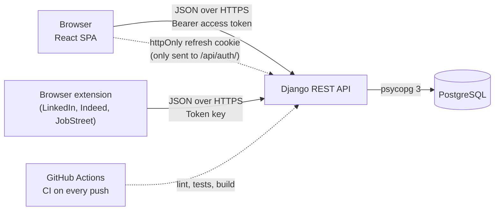
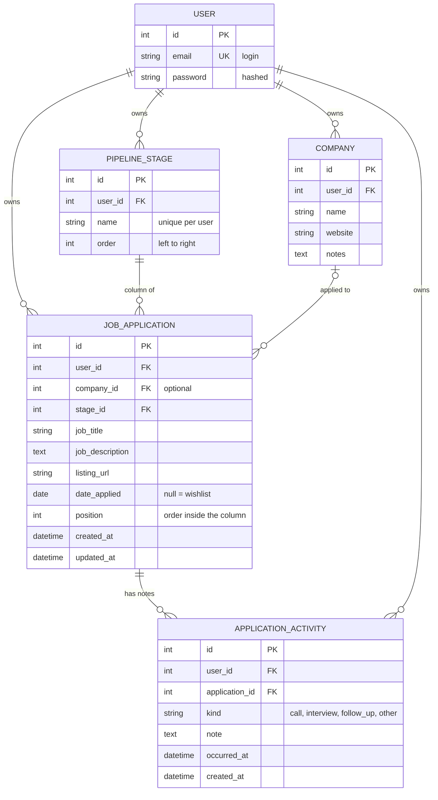

# CareerPipeline

[](https://github.com/Ervzs/CareerPipeline/actions/workflows/ci.yml)

**Track every job application on a Kanban board, and save jobs straight from LinkedIn, Indeed and
JobStreet with the browser extension.**

**Try it:** <https://career-pipeline-fawn.vercel.app>. Press **Try the demo** on the login page, no
sign-up needed.

> The API runs on a free host that sleeps when idle, so the first load can take up to a minute.



## Browser extension: add applications in one click

You don't have to type applications in by hand. The CareerPipeline extension does it while you apply:

- **On LinkedIn (Easy Apply), Indeed and JobStreet:** when the site says your application was sent,
  a small card pops up with the job title, company and link already filled in. Check them, press
  **Save**, and the job is on your board.
- **On any other site** (for example when "Apply" takes you to the company's own website): click the
  extension icon and press **Save as applied**.

Saved jobs go to the **Applied** column, dated today. The same job is never added twice.

**Install (Chrome, Edge or Brave):**

1. Download this repository (**Code → Download ZIP**) and unzip it.
2. Open `chrome://extensions` (or `edge://extensions`) and turn on **Developer mode**.
3. Click **Load unpacked** and choose the `extension` folder.
4. Click the CareerPipeline icon and sign in with:
   - API URL: `https://careerpipeline-api.onrender.com`
   - your CareerPipeline email and password

## How to use the website

1. **Sign up**, or press **Try the demo** to explore a ready-made board.
2. **Add an application.** Only the job title and the job link are needed; company, date and
   description are optional.
3. **Drag cards between columns** as your search moves forward: Wishlist, Applied, Interviewing,
   Offer, Rejected.
4. **Click a card** to see its details, notes about the company, and an activity timeline where you
   log calls, interviews and follow-ups.
5. **Make the board yours:** add, rename, reorder or delete columns.
6. **Open the Dashboard** to see applications per stage, applications per week and your response rate.

## Architecture



The access token (5 minutes) lives only in JavaScript memory. The refresh token (7 days, rotated on
every use) is an `HttpOnly` cookie that scripts can't read, so on every page load the app silently
trades the cookie for a fresh access token. The extension signs in once and uses its own key, which
is revoked when you sign out of it.

## Data model



Every row carries `user_id`, so each user only ever sees their own data. Company is optional, because
many job postings hide who is hiring. A stage or company that still has applications can't be deleted
(`ON DELETE PROTECT`). Activity notes belong to their application and are deleted with it.

## Tech stack

| Layer | Tools |
|---|---|
| Backend | Python, Django 5.2 LTS, Django REST Framework, SimpleJWT, drf-spectacular (OpenAPI), django-cors-headers, WhiteNoise, gunicorn |
| Database | PostgreSQL through psycopg 3 |
| Frontend | React 19, TypeScript, Vite, Tailwind CSS 4, TanStack Query, React Router, dnd-kit |
| Browser extension | Chrome Manifest V3, plain JavaScript |
| Quality | pytest + pytest-django, ruff, Vitest + Testing Library, oxlint, Prettier, GitHub Actions |

## API overview

| Method | Path | Purpose |
|---|---|---|
| POST | `/api/auth/register/` | Create an account (email + password, validated by Django's password validators) |
| POST | `/api/auth/login/` | Returns `{access}`; sets the refresh token as an httpOnly cookie |
| POST | `/api/auth/refresh/` | Reads the cookie, rotates it, returns a new `{access}` |
| POST | `/api/auth/logout/` | Blacklists the refresh token and clears the cookie |
| GET | `/api/auth/me/` | Current user |
| POST, DELETE | `/api/auth/extension-token/` | Email + password → a long-lived key for the browser extension; DELETE revokes it |
| CRUD | `/api/stages/` | Pipeline stages (new stages are appended at the end) |
| POST | `/api/stages/reorder/` | `{"stage_ids": [...]}` — the complete list of your stage ids in the new order |
| CRUD | `/api/companies/` | Companies |
| CRUD | `/api/applications/` | Applications; the list comes back in board order (column, then position) |
| POST | `/api/applications/capture/` | Used by the extension: `{listing_url, job_title, company_name?}` → saved to "Applied", dated today; a listing URL you already saved returns that card (200) |
| PATCH | `/api/applications/{id}/move/` | `{"stage": id, "position": n}` — moves a card and re-sequences both columns |
| GET | `/api/dashboard/` | Per-stage counts, applications per week (12 weeks) and the response rate |
| GET, POST | `/api/applications/{id}/activities/` | List an application's activity notes (newest first) or add one |
| GET, PATCH, PUT, DELETE | `/api/activities/{id}/` | Read, edit or delete one note |
| GET | `/api/health/` | Liveness probe (no authentication, no database access) |

Every request except register/login/refresh/logout/health needs `Authorization: Bearer <access>`
(or `Authorization: Token <key>` from the browser extension).

**Errors** always look like `{"error": {"code": "...", "message": "...", "details": {...}}}`.
Validation problems use `validation_error` (field messages in `details`); blocked deletes
return **409** with `stage_not_empty` or `company_in_use`.

**Creating an application** needs `job_title` and `listing_url`. Company is optional: send
`company` (id of an existing company, or `null`) or `company_name` (finds your company with that
name, or creates it), or neither. Responses include both `company` (id) and a nested
`company_detail`; both are `null` when there is no company.

Interactive API docs (Swagger UI) are at `/api/docs/`.

## Run it locally

Requirements: Python 3.12+, PostgreSQL 14+ and Node 20+.

```powershell
# Backend (http://localhost:8000)
cd backend
python -m venv .venv
.\.venv\Scripts\Activate.ps1
pip install -r requirements-dev.txt
Copy-Item .env.example .env      # set SECRET_KEY and the database settings
python manage.py migrate
python manage.py seed_demo       # creates the demo account
python manage.py runserver

# Frontend (http://localhost:5173), in a second terminal
cd frontend
npm install
Copy-Item .env.example .env
npm run dev
```

Tests: `pytest` in `backend/`, `npm test` in `frontend/`.
